# Capture the Flag #1 #

[Index](../../README.md)

## Goals ##
- Familiarization with binary inspection tools
- Introduction to assembly instructions
- Introduction to Ghidra

## Required Tools ##
- [strings](https://linux.die.net/man/1/strings) / [hexdump](https://linux.die.net/man/1/hexdump) (linux)
- [HxD hex editor](https://mh-nexus.de/en/hxd/) (windows)
- [Ghidra Reverse Engineering Software](https://ghidra-sre.org/)

## Description ##
This exercise uses a binary built from the CTF1 source. When you run the CTF1 binary, you will see the following prompt:

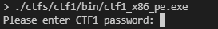

You can enter any string of text that you would like, followed by the `enter` key. If you get the password wrong, you will get a message like the following:

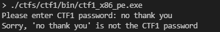

If you get the password correct, you will get a message like the following, but with legible text:

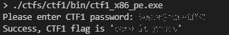

The goal of this exercise is to get the flag without knowing the password beforehand, and without having access to source. In this case you could just go directly to the source code, since it is provided. That would ruin the exercise though. 

The source is provided for those who are curious to try re-compilation of the source with various flags, compilers, and architectures and do comparisons of binaries and of Ghidra output. 

Instead of going to the source, the challenge for the beginner binary hacker is to use the walkthrough below to guide you through the process of capturing the flag using some of the most basic binary reverse engineering tools.

## Solution ##
There are two proposed solutions to this exercise. It is good to be familiar with both, but the Ghidra method will be the most useful for all but the most basic string searches. I suggest you try both.

- [Manually Search the strings](#Manually-search-strings-in-binary) compiled into the binary manually using a tool like [strings](https://linux.die.net/man/1/strings), [hexdump](https://linux.die.net/man/1/hexdump), or [HxD](https://mh-nexus.de/en/hxd/) until you find a likely candidate and then copy it into the ctf1 prompt.
- [Using a reverse engineering tool](#Explore-in-Ghidra) such as [Ghidra]s(https://ghidra-sre.org/), search the strings compiled into the binary and determine which text string is the right one by finding where it is compared against the user input.

1. ### Manually search strings in binary ###

    - #### For the compiled binary: "`ctf1_x86_elf`" ####

        - ##### Windows walkthrough #####
            - Open file in HxD
                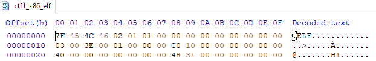
            
            - Find `.ELF` starting at offset `0x0`. This four-byte sequence implies that the binary is compiled as a [Linux executable](https://en.wikipedia.org/wiki/Executable_and_Linkable_Format) and it will have the [ELF header](https://en.wikipedia.org/wiki/Executable_and_Linkable_Format#File_header) which can be manually decoded to find out lots of interesting information. Reverse engineering software will typically decode these well-known headers for you.   

            - Locate several strings near offset `0x2000` that do not look like library names or other OS keywords.

                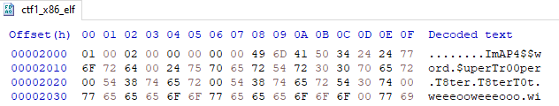

            - Each string of text is separated by a dot. A single possible password can wrap around from the end of one line onto the next as seen with the string `ImAP4$$word` in the image above. Double clicking a string will select it in HxD so that the string can be easily copied and pasted into the prompt when running the binary.

        - ##### Linux walkthrough #####
            - hexdump the binary 

                `$ hexdump ctfs/ctf1/bin/ctf1_x86_elf -C | grep ELF`

                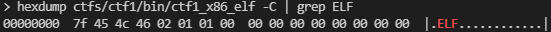
        
            - Find `.ELF` starting at offset `0x0`. This four-byte sequence implies that the binary is compiled as a [Linux executable](https://en.wikipedia.org/wiki/Executable_and_Linkable_Format) and it will have the [ELF header](https://en.wikipedia.org/wiki/Executable_and_Linkable_Format#File_header) which can be manually decoded to find out lots of interesting information. Reverse engineering software will typically decode these well-known headers for you.   

            - Find strings near offset `0x2000` by scrolling or using [regular expressions](https://en.wikipedia.org/wiki/Regular_expression) with something like [grep](https://man7.org/linux/man-pages/man1/grep.1.html).

                `$ hexdump ctfs/ctf1/bin/ctf1_x86_elf -C -s 0x2000 | more`

                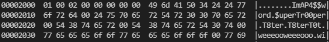

            - Each string of text is separated by a dot. A single possible password can wrap around from the end of one line onto the next as seen with the string `ImAP4$$word` in the image above. 

    - #### For the compiled binary "`ctf1_x86_pe.exe`" ####
        - ##### - Windows Walkthrough #####
            - Open file in HxD
            
                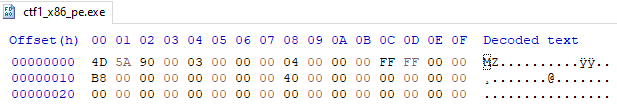
        
            - Find `MZ` starting at offset `0x0`. This two-byte sequence implies that the binary is compiled as a [windows executable](https://en.wikipedia.org/wiki/Portable_Executable) and it will have the [DOS header](https://en.wikipedia.org/wiki/DOS_MZ_executable) which can be manually decoded to find out lots of interesting information. Reverse engineering software will typically decode these well-known headers for you.   

            - Find strings near offset `0x2000` by scrolling until you find text that does not look like library names or other OS keywords.

            - Each string of text is separated by a dot. A single possible password can wrap around from the end of one line onto the next as seen with the string `ImAP4$$word` in the image above. Double clicking a string will select it in HxD so that the string can be easily copied and pasted.

        - ##### Linux Walkthrough #####
            - hexdump the binary

                `$ hexdump ctfs/ctf1/bin/ctf1_x86_pe.exe -C | grep MZ`

                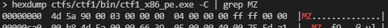
        
            - Find `MZ` at offset `0x0`. This two-byte sequence implies that the binary is compiled as a [windows executable](https://en.wikipedia.org/wiki/Portable_Executable) and it will have the [DOS header](https://en.wikipedia.org/wiki/DOS_MZ_executable) which can be manually decoded to find out lots of interesting information. Reverse engineering software will typically decode these well-known headers for you.   

            - Locate strings near offset `0x11B60` by scrolling or using [regular expressions](https://en.wikipedia.org/wiki/Regular_expression) with something like [grep](https://man7.org/linux/man-pages/man1/grep.1.html).

                `$ hexdump ctfs/ctf1/bin/ctf1_x86_pe.exe -C -s 0x11B60 | more`

                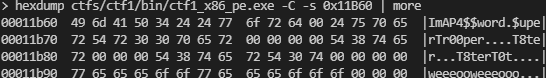

            - Each string of text is separated by a dot. A single possible password can wrap around from the end of one line onto the next as seen with the string `ImAP4$$word` in the image above. 

1. ### Explore in Ghidra ###
    - Import the binary "`ctf1_x86_elf`" using Ghidra
        - Find the password and flag strings in Ghidra.

            There are two options here
            
            1. ***Use the offset*** you already got in the steps above to find the strings in the binary 
            1. ***Use Ghidra*** tools to find the strings in the binary 

                Either method will work

            ----

            1. ***Use the offset***  
                
                Use the offset we saw in the string search to go directly to the strings. You must combine the string offset from the binary (0x2000) with the offset at which the binary was loaded into memory as seen in the image (0x100000).

                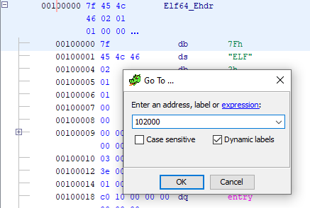

            1. ***Use Ghidra***

                - Open the strings window in Ghidra 
    
                    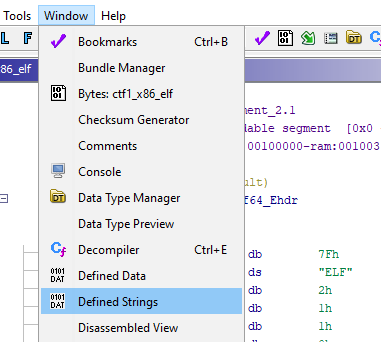

                - Double click one of the strings to go the address at which it is defined.
                
                    

        - Locate the function where the strings are used

            Double click the function name `FUN_001011a9` to navigate to that function.

            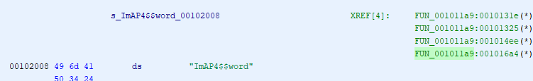

        - Look through assembly code and pseudo-c code 

            The logic can be followed by observing the code in the screenshot. By following these steps yourself, you will be able to see the flag clearly in the code, or you can run the binary and pass the correct password.

            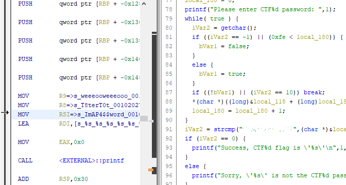

