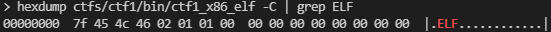
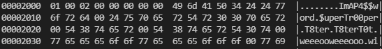
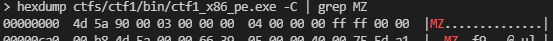
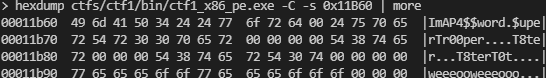

# Capture the Flag #1

[Index](../../README.md)

## Goals
- Familiarization with binary inspection tools
- Introduction to assembly instructions

## Solution:
1. Search strings in binary
    - `ctf1_x86_elf`
        - Find `.ELF` starting at address `0x0`

            `$ hexdump ctfs/ctf1/bin/ctf1_x86_elf -C | grep ELF`

            

        - Strings near address `0x2000`

            `$ hexdump ctfs/ctf1/bin/ctf1_x86_elf -C -s 0x2000 | more`

            

    - `ctf1_x86_pe`
        - Find `MZ` at address `0x0`

            `$ hexdump ctfs/ctf1/bin/ctf1_x86_pe.exe -C | grep MZ`

            

        - Strings near address `0x11B60`

            `$ hexdump ctfs/ctf1/bin/ctf1_x86_pe.exe -C -s 0x11B60 | more`

            
    - tools
        - `strings`
        - `ghex / hexdump`
        - `ghidra`
        - `ida`
            - Find suspicious strings