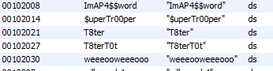

# Capture the Flag #1

[Index](../../README.md)

## Goals
- Familiarization with binary inspection tools
- Introduction to assembly instructions

## Required Tools
- [strings](https://linux.die.net/man/1/strings) / [hexdump](https://linux.die.net/man/1/hexdump) (linux)
- [HxD hex editor](https://mh-nexus.de/en/hxd/) (windows)
- [Ghidra Reverse Engineering Software](https://ghidra-sre.org/)

## Solution:
1. Search strings in binary
    - `ctf1_x86_elf`
        - Windows
            - Find `.ELF` starting at address `0x0`

                Open file in HxD
                

            - Strings near address `0x2000`

                Open file in HxD, scroll
                
        - Linux 
            - Find `.ELF` starting at address `0x0`

                `$ hexdump ctfs/ctf1/bin/ctf1_x86_elf -C | grep ELF`

                

            - Strings near address `0x2000`

                `$ hexdump ctfs/ctf1/bin/ctf1_x86_elf -C -s 0x2000 | more`

                

    - `ctf1_x86_pe`
        - Windows
            - Find `.ELF` starting at address `0x0`

                Open file in HxD
                

            - Strings near address `0x2000`

                Open file in HxD, scroll
                
        - Linux 
            - Find `MZ` at address `0x0`

                `$ hexdump ctfs/ctf1/bin/ctf1_x86_pe.exe -C | grep MZ`

                

            - Strings near address `0x11B60`

                `$ hexdump ctfs/ctf1/bin/ctf1_x86_pe.exe -C -s 0x11B60 | more`

                

1. Explore in Ghidra
    - `ctf1_x86_elf`
        - Find the password and flag strings in Ghidra
            - Use the offset we saw in the string search to go directly to the strings. You must combine the string offset from the binary (0x2000) with the offset at which the binary was loaded into memory as seen in the image (0x100000).

                

            - You can also use the string window in Ghidra

                

                Double click one of the strings to go the address at which it is defined.
                
                

        - Locate the function where the strings are used

            Double click the function name `FUN_001011a9` to navigate to that function.

            

        - Look through assembly code and pseudo-c code 

            The logic can be followed by observing the code in the screenshot. By following these steps yourself, you will be able to see the flag clearly in the code, or you can run the binary and pass the correct password.

            

