# CTF#2 #

## Capture the Flag #2 ##

Your first obfuscated password

---

## Table of Contents ##

[MAIN README](../../README.md)

[CTF#2](#ctf\#2)

- [Goals](#goals)
- [Required Tools](#required-tools)
- [Building the Binary](#building-the-binary)
- [Description](#description)
- [Obfuscation](#obfuscation)
- [Walkthrough](#walkthrough)
  - [Manually search strings in binary](#manually-search-strings-in-binary)
  - [Explore in Ghidra](#explore-in-ghidra)

---

## Goals ##

- Capture the flag
- Introduction to [hexdump](https://linux.die.net/man/1/hexdump) / [HxD](https://mh-nexus.de/en/hxd/) / [strings](https://linux.die.net/man/1/strings)
- Introduction to [assembly instructions](https://en.wikipedia.org/wiki/Assembly_language)
- Introduction to [Ghidra](https://ghidra-sre.org/)
- Introduction to obfuscation concepts

---

## Required Tools ##

See [Required Tools](../../README.md#Required-Tools) section in the main README.

---

## Building the Binary ##

See [Compiling The CTF Binaries](../../README.md#Compiling-The-CTF-Binaries) section in the main README.

---

## Description ##

This exercise uses a binary built from the CTF2 source found in `./RECTFDEMOS/ctfs/ctf2/src`. Do not look at the source code unless you get stuck. If you have already built a binary from source, then it should be located in `./RECTFDEMOS/ctfs/ctf2/bin`. In windows, run `ctf2_x86_pe.exe`, on a Linux system run `ctf2_x86_elf`.

When you run the CTF2 binary, you will see the following prompt:

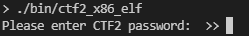

You can enter any string of text that you would like, followed by the `enter` key. If you get the password wrong, you will get a message like the following:

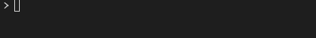

If you get the password correct, you will get a message like the following, but with legible text:

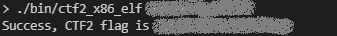

It is useful to note that you can also give the password to the binary as an argument for faster testing.

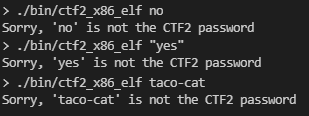

The goal of this exercise is to get the flag without knowing the password beforehand, and without having access to source. In this case you could just go directly to the source code, since it is provided. That would ruin the exercise though. The source is provided for those who are curious to try re-compilation of the source with various flags, compilers, and architectures and do comparisons of binaries and of Ghidra output.

Instead of going to the source, the challenge for the beginner binary hacker is to use the walkthrough below to guide you through the process of capturing the flag using some of the most basic binary reverse engineering tools.

---

## Obfuscation ##

For the exercises in this repository various obfuscation techniques are used to make the passwords harder to find. The obfuscation methods used range from trivial ones defeated by simply viewing the binary data, to simple cryptographic methods.

Obfuscation for this exercise was done by storing [ASCII](https://en.wikipedia.org/wiki/ASCII) data as integers instead of as C's char or byte [data types](https://en.wikipedia.org/wiki/C_data_types). This does not change the underlying data being stored in the binary, but it does cause the text to be stored in a way that can confuse automated string-recognition tools.

---

## Walkthrough ##

There are two proposed solutions to this exercise. It is good to be familiar with both, but the Ghidra method is the most useful for all but the most basic string searches. I suggest you try both since the manual method is also useful for things besides binary reverse engineering.

- Proposed Solutions:

    1. [Manually Search](#Manually-search-strings-in-binary)

        Manually Search the strings compiled into the binary manually using a tool like [strings](https://linux.die.net/man/1/strings), [hexdump](https://linux.die.net/man/1/hexdump), or [HxD](https://mh-nexus.de/en/hxd/) until you find a likely password string and then copy it into the ctf1 password prompt.

    2. [Use a reverse engineering tool](#Explore-in-Ghidra)

        Using a reverse engineering tool such as [Ghidra](https://ghidra-sre.org/), search the strings compiled into the binary and determine which text string is the right one by finding where it is compared against the user input.

### Manually search strings in binary ###

1. Windows walkthrough

    - Open "`ctf2_arm_elf`" in HxD

        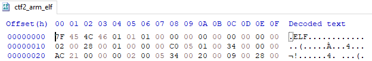

    - Find `.ELF` starting at offset `0x0`. This four-byte sequence implies that the binary is compiled as a [Linux executable](https://en.wikipedia.org/wiki/Executable_and_Linkable_Format) and it will have the [ELF header](https://en.wikipedia.org/wiki/Executable_and_Linkable_Format#File_header) which can be manually decoded to find out lots of interesting information. Reverse engineering software will typically decode these well-known headers for you.

    - Locate several strings near offset `0xF90` that do not look like library names or other OS keywords.

        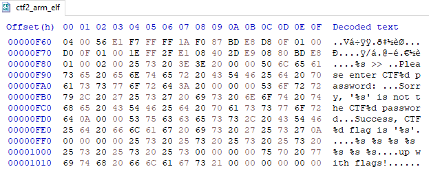

        Each string of text is separated by a dot. A single possible password can wrap around from the end of one line onto the next as seen with the string "`up with flags`" in the image above. Double clicking a string will select it in HxD so that the string can be easily copied and pasted into the prompt when running the CTF1 binary.

    - Scroll through the visible strings and copy/paste each likely candidate into the ctf binary until you have found the correct password and the flag.

2. Linux walkthrough

    - [hexdump](https://man7.org/linux/man-pages/man1/hexdump.1.html) the binary. Search for "ELF" string using [grep](https://man7.org/linux/man-pages/man1/grep.1.html).

        `$ hexdump ctfs/ctf2/bin/ctf2_arm_elf -C | grep ELF`

        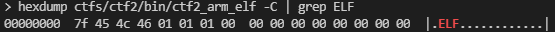

    - Find `.ELF` starting at offset `0x0`. This four-byte sequence implies that the binary is compiled as a [Linux executable](https://en.wikipedia.org/wiki/Executable_and_Linkable_Format) and it will have the [ELF header](https://en.wikipedia.org/wiki/Executable_and_Linkable_Format#File_header) which can be manually decoded to find out lots of interesting information. Reverse engineering software will typically decode these well-known headers for you when you open a binary with them.

    - Find strings near offset `0x1000` using [strings](https://man7.org/linux/man-pages/man1/strings.1.html) and [more](https://man7.org/linux/man-pages/man1/more.1.html).

        `$ strings ctfs/ctf2/bin/ctf2_arm_elf -t x -a | more`

        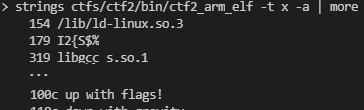

    - Scroll through the visible strings and copy/paste each likely candidate into the ctf binary until you have found the correct password and the flag.

#### Explore in Ghidra ####

- Import the binary "`ctf2_arm_elf`" using Ghidra

- Open strings window using Menu `Window->Defined Strings`

    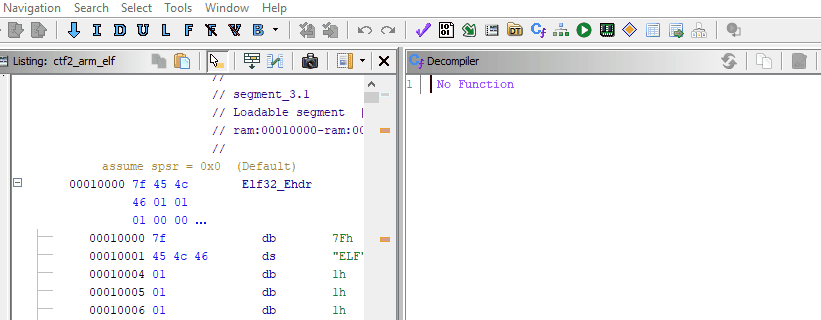

- Find a likely string in the list. Double click it to navigate to its memory location. Double click the function name in the xrefs to the right of the string definition (`FUN_000108fc`).

    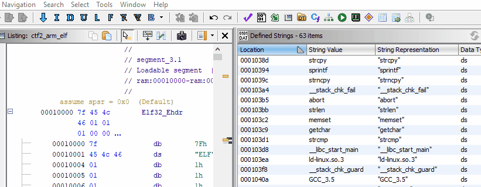

- Note the two variables being compared in order to test whether the binary will print "Success" or "Sorry".

    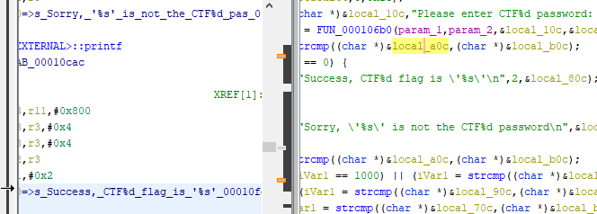

    One of two paths makes sense here. Investigate `local_80c`, or investigate `local_a0c`. `local_b0c` seems to be the user input since it is printed as part of the failure message ([printf](https://www.cplusplus.com/reference/cstdio/printf/)), and it is string compared ([strcmp](https://www.cplusplus.com/reference/cstring/strcmp/)) against `local_a0c` which must be storing the correct password. This leaves `local_80c` as the flag that is printed out on success.

    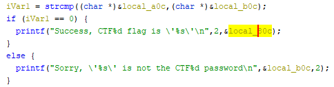

- Scroll up to the point at which `local_80c` is assigned.

    You will note that in the assembly on the left that the string assignment (the string starting with `"down with"`) is visible despite being incomprehensible in c code on the right. This appears to be the flag, but we can verify that with a bit more work.

    

- Scroll to the point at which `local_a0c` is assigned.

    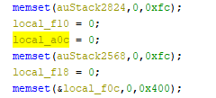

    That isn't very interesting, find where else it is used.

    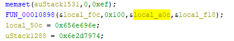

    Investigate `FUN_00010898` to see what it is doing with our data.

    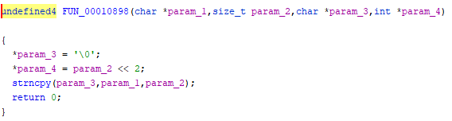

    This calls [strncpy](https://www.cplusplus.com/reference/cstring/strncpy/).

    `char * strncpy ( char * destination, const char * source, size_t num );`

    Which will copy up to 256 bytes of string `local_f0c` into string `local_a0c`. This means that `local_f0c` is, in fact, the password. Lets find where `local_f0c` is assigned.

    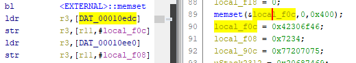

    This looks promising because the assignment looks like all the other string assignments. However, Ghidra hasn't displayed the string as a string automatically. We could find an [ASCII TABLE](https://www.asciitable.com/) and look up the hex values 0x42, 0x30, 0x6F, etc. in order to decode the string, but lets try using Ghidra here. Double click on `DAT_00010edc` in the assembly view since that is what is being loaded into `local_f0c` using the `ldr/str` opcodes.

    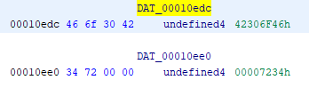

    Click on `DAT_00010edc` and press the single quote (`"'"`) key on the keyboard to cycle through string formats. This confirms that the data is ASCII, so format it as a string by right clicking on the label of the address and selecting `Data->string`

    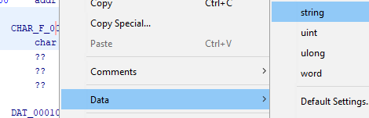

    The string value of the password is now clearly visible.
