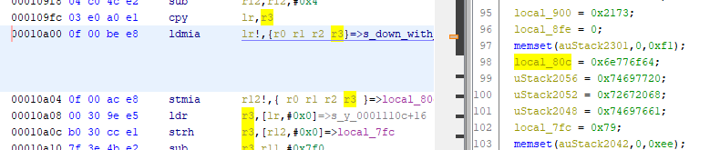

# Capture the Flag #2

[Index](../../README.md)

## Goals
- Familiarization with binary inspection tools
- Introduction to assembly instructions
- Introduce obfuscation concepts
- Introduce stripped binary vs binary with debug symbols

## Required Tools
- [strings](https://linux.die.net/man/1/strings) / [hexdump](https://linux.die.net/man/1/hexdump) (linux)
- [HxD hex editor](https://mh-nexus.de/en/hxd/) (windows)
- [Ghidra Reverse Engineering Software](https://ghidra-sre.org/)

## Solution:
1. Search strings in binary `ctf2_arm_elf`
    - Windows
        - Open binary in HxD
        - Find `ELF` at address `0x0`

            

        - Scroll until you find suspicious looking strings

            

    - Linux
        - Find `ELF` at address `0x0`

            `$ hexdump ctfs/ctf2/bin/ctf2_arm_elf -C | grep ELF`

            

        - Strings near `0x1000`

            `$ strings ctfs/ctf2/bin/ctf2_arm_elf -t x -a | more`

            

1. Find password or flag using Ghidra

    - Open binary in Ghidra

    - Open strings window using Menu `Window->Defined Strings`

    - Find a likely string in the list. Double click it to navigate to its memory location. Double click the function name in the xrefs to the right of the string definition (`FUN_000108fc`).

        

    - Note the two variables being compared in order to test whether the binary will print "Success" or "Sorry".

        

        One of two paths makes sense here. Investigate `local_80c`, or investigate `local_a0c`. `local_b0c` seems to be the user input since it is printed as part of the failure message, and it is string compared (strcmp) against `local_a0c` which must be storing the correct password. This leaves `local_80c` as the flag that is printed out on success.

        

    - Scroll up to the point at which `local_80c` is assigned. 

        You will note that in the assembly the string assignment (the string starting with `"down with"`) is visible despite being incomprehensible in c code. This appears to be the flag. 

        

    - Scroll to the point at which `local_a0c` is assigned. 

        

        That isn't very interesting, find where else it is used. 

        

        

        This calls strncpy.

        `char * strncpy ( char * destination, const char * source, size_t num );`

        Which will copy up to 256 bytes of string `local_f0c` into string `local_a0c`. This means that `local_f0c` is, in fact, the password. Lets find where `local_f0c` is assigned. 

        

        This looks promising because the assignment looks mostly like all the other string assignments. However, Ghidra hasn't displayed the string as a string automatically. We could find an [ASCII TABLE](https://www.asciitable.com/) and look up the hex values 0x42, 0x30, 0x6F, etc. in order to decode the string, but lets try using Ghidra here. Double click on `DAT_00010edc` in the assembly view since that is what is being loaded into `local_f0c` using the `ldr/str` opcodes.

        

        Click on `DAT_00010edc` and press the single quote (`"'"`) key on the keyboard to cycle through string formats. This confirms that the data is ASCII, so format it as a string by right clicking on the label of the address and selecting `Data->string`

         

        The string value of the password is now clearly visible.