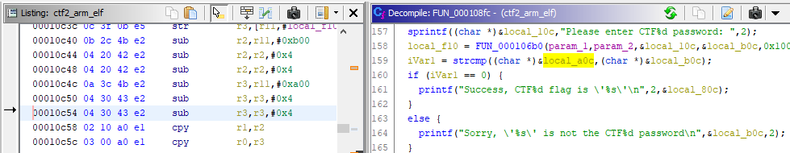

# Capture the Flag #2 #

[Index](../../README.md)

## Goals ##

- Familiarization with binary inspection tools
- Introduction to assembly instructions
- Introduce obfuscation concepts

## Required Tools ##

- [strings](https://linux.die.net/man/1/strings) / [hexdump](https://linux.die.net/man/1/hexdump) (linux)
- [HxD hex editor](https://mh-nexus.de/en/hxd/) (windows)
- [Ghidra Reverse Engineering Software](https://ghidra-sre.org/)

## Description ##

This exercise uses a binary built from the CTF2 source. When you run the CTF2 binary, you will see the following prompt:

You can enter any string of text that you would like, followed by the `enter` key. If you get the password wrong, you will get a message like the following:

If you get the password correct, you will get a message like the following, but with legible text:

It is useful to note that you can also give the password to the binary as an argument for faster testing.

The goal of this exercise is to get the flag without knowing the password beforehand, and without having access to source. In this case you could just go directly to the source code, since it is provided. That would ruin the exercise though.

The source is provided for those who are curious to try re-compilation of the source with various flags, compilers, and architectures and do comparisons of binaries and of Ghidra output.

Instead of going to the source, the challenge for the beginner binary hacker is to use the walkthrough below to guide you through the process of capturing the flag using some of the most basic binary reverse engineering tools.

**Obfuscation** in this exercise was done by storing [ASCII](https://en.wikipedia.org/wiki/ASCII) data as integers instead of as C's char or byte [data types](https://en.wikipedia.org/wiki/C_data_types).

## Solution ##

There are two proposed solutions to this exercise. It is good to be familiar with both, but the Ghidra method will be the most useful for all but the most basic string searches. I suggest you try both.

- [Manually Search the strings](#Manually-search-strings-in-binary) compiled into the binary manually using a tool like [strings](https://linux.die.net/man/1/strings), [hexdump](https://linux.die.net/man/1/hexdump), or [HxD](https://mh-nexus.de/en/hxd/) until you find a likely candidate and then copy it into the ctf1 prompt.
- [Using a reverse engineering tool](#Explore-in-Ghidra) such as [Ghidra](https://ghidra-sre.org/), search the strings compiled into the binary and determine which text string is the right one by finding where it is compared against the user input.

1. ### Manually search strings in binary ###

    - Search strings in binary "`ctf2_arm_elf`"

        - Windows

            - Open binary in HxD

                Find `ELF` at address `0x0`

                

            - Scroll until you find suspicious looking strings

                

        - Linux

            - Use hexdump

                `$ hexdump ctfs/ctf2/bin/ctf2_arm_elf -C | grep ELF`

                

            - Find `ELF` at address `0x0`

        - Locate strings near `0x1000`

            `$ strings ctfs/ctf2/bin/ctf2_arm_elf -t x -a | more`

            

1. ### Find password or flag using Ghidra ###

    - import "`ctf2_arm_elf`" binary in Ghidra

    - Open strings window using Menu `Window->Defined Strings`

    - Find a likely string in the list. Double click it to navigate to its memory location. Double click the function name in the xrefs to the right of the string definition (`FUN_000108fc`).

        

    - Note the two variables being compared in order to test whether the binary will print "Success" or "Sorry".

        

        One of two paths makes sense here. Investigate `local_80c`, or investigate `local_a0c`. `local_b0c` seems to be the user input since it is printed as part of the failure message, and it is string compared (strcmp) against `local_a0c` which must be storing the correct password. This leaves `local_80c` as the flag that is printed out on success.

        

    - Scroll up to the point at which `local_80c` is assigned.

        You will note that in the assembly the string assignment (the string starting with `"down with"`) is visible despite being incomprehensible in c code. This appears to be the flag.

        

    - Scroll to the point at which `local_a0c` is assigned.

        

        That isn't very interesting, find where else it is used.

        

        

        This calls strncpy.

        `char * strncpy ( char * destination, const char * source, size_t num );`

        Which will copy up to 256 bytes of string `local_f0c` into string `local_a0c`. This means that `local_f0c` is, in fact, the password. Lets find where `local_f0c` is assigned.

        

        This looks promising because the assignment looks mostly like all the other string assignments. However, Ghidra hasn't displayed the string as a string automatically. We could find an [ASCII TABLE](https://www.asciitable.com/) and look up the hex values 0x42, 0x30, 0x6F, etc. in order to decode the string, but lets try using Ghidra here. Double click on `DAT_00010edc` in the assembly view since that is what is being loaded into `local_f0c` using the `ldr/str` opcodes.

        

        Click on `DAT_00010edc` and press the single quote (`"'"`) key on the keyboard to cycle through string formats. This confirms that the data is ASCII, so format it as a string by right clicking on the label of the address and selecting `Data->string`

        

        The string value of the password is now clearly visible.
