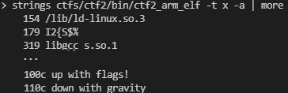

# Capture the Flag #2

[Index](../../README.md)

## Goals
- Familiarization with binary inspection tools
- Introduction to assembly instructions
- Introduce obfuscation concepts
- Introduce stripped binary vs binary with debug symbols

## Solution:
1. Search strings in binary
    - `ctf2_x86_elf`
        - Find `.ELF` at address `0x0`

            `$ hexdump ctfs/ctf2/bin/ctf2_x86_elf -C | grep ELF`

             

        - Strings near address `0x1720`

            `$ strings ctfs/ctf2/bin/ctf2_x86_elf -t x -a | more`

            

    - `ctf2_arm_pe.exe`
        - Find `MZ` at address `0x0`

            `$ hexdump ctfs/ctf2/bin/ctf2_arm_elf -C | grep ELF`

            

        - Strings near `0x1000`

            `$ strings ctfs/ctf2/bin/ctf2_arm_elf -t x -a | more`

            

            
    - tools
        - `strings`
        - `ghex / hexdump`
        - `ghidra`
        - `ida`
            - Find suspicious strings