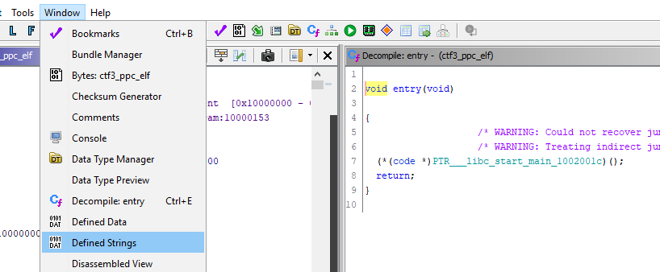

# Capture the Flag #3 #

[Index](../../README.md)

## Goals ##

- Familiarization with binary inspection tools
- Introduce slightly more complex obfuscation reversal

## Required Tools ##

- [strings](https://linux.die.net/man/1/strings) / [hexdump](https://linux.die.net/man/1/hexdump) (linux)
- [HxD hex editor](https://mh-nexus.de/en/hxd/) (windows)
- [Ghidra Reverse Engineering Software](https://ghidra-sre.org/)

## Description ##

This exercise uses a binary built from the CTF3 source. When you run the CTF3 binary, you will see the following prompt:

You can enter any string of text that you would like, followed by the `enter` key. If you get the password wrong, you will get a message like the following:

If you get the password correct, you will get a message like the following, but with legible text:

The goal of this exercise is to get the flag without knowing the password beforehand, and without having access to source. In this case you could just go directly to the source code, since it is provided. That would ruin the exercise though.

The source is provided for those who are curious to try re-compilation of the source with various flags, compilers, and architectures and do comparisons of binaries and of Ghidra output.

Instead of going to the source, the challenge for the beginner binary hacker is to use the walkthrough below to guide you through the process of capturing the flag using some of the most basic binary reverse engineering tools.

**Obfuscation** in this exercise was done by storing [ASCII](https://en.wikipedia.org/wiki/ASCII) data as [integer data](https://en.wikipedia.org/wiki/C_data_types) and scaling the integers.

## Solution ##

1. Search strings in binary "`ctf3_ppc_elf`"
    - Print hexadecimal value of binary with addresses and ASCII values

        `$ hexdump -C bin/ctf3_ppc_elf | more`

        Notice `.ELF` at address `0x0`

    - Print strings with their hexadecimal offsets

        `$ strings -t x bin/ctf3_ppc_elf`

        Interesting strings near `0xF9C`

2. Use Ghidra

    - Import "`ctf3_ppc_elf`" into Ghidra

    - Open the strings Window

        

    - Look for strings you saw when using the software like "please enter the password".

        

    - Click on a string to go to the memory address where it is defined. Double click on the XREF function to the right of the defined string to go to the function where the string is used.

        

    - When the user submits a password, it is stored in `local_414`. We can tell this because that is compared and then later printed back to the user as seen in the decompilation from Ghidra below. This means `local_614` must have the real password in it, and `local_e18` must be the flag.

        

    - If we try to determine the password, we can trace `local_614` upwards. We find that it is assigned using a function call, and investigation of the function call could be done to determine how the password data is being manipulated.

        

    - We can also trace `local_e14` to where it is first assigned, since that is the variable that is manipulated and then assigned to `local_614`, our password. But is is not immediately obvious how to convert this password into readable text.

        

    - Go back to where the password and flag are to trace the flag logic instead.

        

    - Trace `local_e18` to its assignment. This is clearly the flag.
