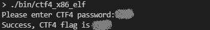

# CTF#4 #

## Capture the Flag #4 ##

Your first attempt at reverse engineering logic.

---

## Table of Contents ##

[MAIN README](../../README.md)

[CTF#4](#ctf\#4)

- [Goals](#goals)
- [Required Tools](#required-tools)
- [Building the Binary](#building-the-binary)
- [Description](#description)
- [Obfuscation](#obfuscation)
- [Walkthrough](#walkthrough)
  - [Identify Binary Header](#identify-binary-header)
  - [Find Flag](#find-flag)
  - [Find Password](#find-password)

---

## Goals ##

- Familiarization with binary inspection tools
- Easy win, clear-text password can be pulled from binary despite obfuscation

## Required Tools ##

- [strings](https://linux.die.net/man/1/strings) / [hexdump](https://linux.die.net/man/1/hexdump) (linux)
- [HxD hex editor](https://mh-nexus.de/en/hxd/) (windows)
- [Ghidra Reverse Engineering Software](https://ghidra-sre.org/)

---

## Building the Binary ##

See [Compiling The CTF Binaries](../../README.md#Compiling-The-CTF-Binaries) section in the main README.

---

## Description ##

This exercise uses a binary built from the CTF4 source. When you run the CTF4 binary, you will see the following prompt:

You can enter any string of text that you would like, followed by the `enter` key. If you get the password wrong, you will get a message like the following:

If you get the password correct, you will get a message like the following, but with legible text:

It is useful to note that you can also give the password to the binary as an argument for faster testing.

The goal of this exercise is to get the flag without knowing the password beforehand, and without having access to source. In this case you could just go directly to the source code, since it is provided. That would ruin the exercise though.

The source is provided for those who are curious to try re-compilation of the source with various flags, compilers, and architectures and do comparisons of binaries and of Ghidra output.

Instead of going to the source, the challenge for the beginner binary hacker is to use the walkthrough below to guide you through the process of capturing the flag using some of the most basic binary reverse engineering tools.

---

## Obfuscation ##

Obfuscation for this exercise was done by storing [ASCII](https://en.wikipedia.org/wiki/ASCII) data as C's char [data type](https://en.wikipedia.org/wiki/C_data_types), and then a simple and reversible mathematical function was applied to the 8-bit char values.

---

## Walkthrough ##

This solution is specific to the binary named "`ctf4_arm_elf_debug`".

### Identify Binary Header ###

The four-byte sequence `.ELF` at the beginning of the binary means that the binary is compiled as a [Linux executable](https://en.wikipedia.org/wiki/Executable_and_Linkable_Format) and it will have the [ELF header](https://en.wikipedia.org/wiki/Executable_and_Linkable_Format#File_header) which can be manually decoded to find out lots of interesting information. Reverse engineering software will typically decode these well-known headers for you.

1. Locate `.ELF` at address `0x0`

    - Linux - hexdump

        `$ hexdump -C ./bin/ctf4_arm_elf_debug | more`

        

    - Windows - HxD

        Open `ctf4_arm_elf_debug` using HxD or another hex viewer/editor.

        

2. Open `ctf4_arm_elf_debug` using Ghidra

    - Import the binary
    - Analyze the binary
    - Open the "Defined Strings" window
    - Locate a recognizable string in the strings window
    - Select a string in the strings window

        

        Selecting a string takes you to the string's definition in the binary in the `Listing` window.

        

        This string is defined at hexadecimal address or offset `00010C24`. Ghidra also shows on the right hand side that the string is used in function `FUN_00010858`, which is fun.

    - Double click on the function name `00010C24` to go to that function in the listing window, and to decompile it. Make sure you have the decompile window visible.

        

    - Scroll down to the password checking logic in the decompile window.

        

    - Identify the local variables of interest. This can be done just from the logic in the screenshot above.

        | Use               | Name       |
        |:------------------|:-----------|
        | Password          | `local_f0` |
        | Flag              | `local_a8` |
        | User input        | `local_dc` |

3. Pick a path:

    1. [Find the flag](#Find-Flag) by investigating `local_a8`
    1. [Find the password](#Find-Password) by investigating `local_f0`

### Find Flag ###

- Investigate `local_a8` since the flag is the goal.

    It is initialized to zero

    

    `local_a8` is used in function call to function `FUN_000107c0` as third argument.

    

- Determine function of third argument in `FUN_000107c0`

    

    The following table was created by tracing the logic in the screenshot above.

    | Argument      | Usage |
    |:--------------|:------|
    | `param_1`     | input string pointer      |
    | `param_2`     | integer limit of [for-loop](https://en.wikipedia.org/wiki/For_loop#Traditional_for-loops) |
    | `param_3`     | output string pointer      |
    | `param_4`     | integer pointer is given a copy of `param_2`      |
    | `param_5`     | [XOR](https://en.wikipedia.org/wiki/Exclusive_or)'d against each byte of `param_1` in a loop     |

    Based on this effort, we can tell that `param_1` is XOR'd against `param_5` byte-by-byte and copied into `param_3`. Therefore, `param_1` holds the flag in byte format and we would have to write a helper script to XOR the bytes ourselves, or just do this in a calculator for each byte.

    Looking back at where `FUN_000107c0` is called, we can see that `param_1` is actually `local_74`. If we scroll up to the assignment of `local_74` we can find the flag data.

- Reverse engineer the flag

    

    This local variable is better traced in assembly. See on the left where the [ldmia](https://developer.arm.com/search#q=ldmia) opcode is used to load multiple words from an address in the binary named `DAT_00010ca0`.

    Navigate to `DAT_00010ca0` either by clicking it, or pressing the `goto` command shortcut `g` and typing in the address `00010ca0`.

    

- Reformat the data

    This is supposed to be a string of bytes, not 3 separate chunks of data. So select each of the labels `DAT_00010ca0`, `DAT_00010ca4`, and `DAT_00010ca8` and press the `clear` command shortcut `c` to clear formatting.

    

- Apply the [XOR](https://en.wikipedia.org/wiki/Exclusive_or) function to each byte of this sequence using the operand defined in `param_5`.

    If you XOR'd correctly, you have the flag.

### Find Password ###

- Investigate `local_f0` since it is used when checking using input for validity.

    

    The password is clearly visible in the assignment.
