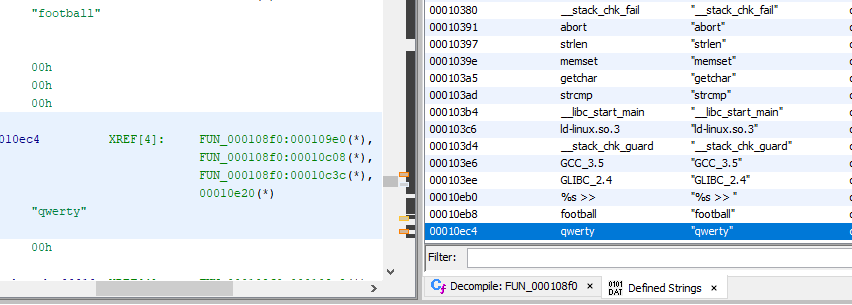
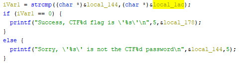

# CTF#5 #

## Capture the Flag #5 ##

---

## Table of Contents ##

[MAIN README](../../README.md)

[CTF#5](#ctf5)

- [Goals](#goals)
- [Required Tools](#required-tools)
- [Building the Binary](#building-the-binary)
- [Description](#description)
- [Obfuscation](#obfuscation)
- [Walkthrough](#walkthrough)

---

## Goals ##

- Familiarization with binary inspection tools
- Ignore distractions
- De-obfuscation practice
- ASCII tables

---

## Required Tools ##

- [strings](https://linux.die.net/man/1/strings) / [hexdump](https://linux.die.net/man/1/hexdump) (linux)
- [HxD hex editor](https://mh-nexus.de/en/hxd/) (windows)
- [Ghidra Reverse Engineering Software](https://ghidra-sre.org/)

---

## Building the Binary ##

See [Compiling The CTF Binaries](../../README.md#Compiling-The-CTF-Binaries) section in the main README.

---

## Description ##

This exercise uses a binary built from the CTF5 source. When you run the CTF5 binary, you will see the following prompt:

You can enter any string of text that you would like, followed by the `enter` key. If you get the password wrong, you will get a message like the following:

If you get the password correct, you will get a message like the following, but with legible text:

It is useful to note that you can also give the password to the binary as an argument for faster testing.

The goal of this exercise is to get the flag without knowing the password beforehand, and without having access to source. In this case you could just go directly to the source code, since it is provided. That would ruin the exercise though. The source is provided for those who are curious to try re-compilation of the source with various flags, compilers, and architectures and do comparisons of binaries and of Ghidra output.

Instead of going to the source, the challenge for the beginner binary hacker is to use the walkthrough below to guide you through the process of capturing the flag using some of the most basic binary reverse engineering tools.

---

## Obfuscation ##

Obfuscation for this exercise was done by storing [ASCII](https://en.wikipedia.org/wiki/ASCII) data as C's char [data type](https://en.wikipedia.org/wiki/C_data_types), and then a simple and reversible mathematical function was applied to the 8-bit char values.

---

## Walkthrough ##

1. Open `ctf5_arm_elf` using Ghidra

    - Import the binary
    - Analyze the binary

2. Find the password checking function

    - Open the "Defined Strings" window
    - Locate a recognizable string in the strings window
    - Select a string in the strings window

        

        Click decompilation window to bring it into the foreground.

        

3. Initial investigation of `FUN_000108f0`

    - Identify variables of particular interest.

        

        | Variable    | Usage               |
        |:------------|:--------------------|
        | `local_178` | Flag                |
        | `local_144` | User Input          |
        | `local_1bc` | Possible Password 1 |
        | `local_dc`  | Possible Password 2 |
        | `local_1b8` | Possible Password 3 |
        | `local_1ac` | Possible Password 4 |
        | `local_1b4` | Possible Password 5 |
        | `local_1b0` | Possible Password 6 |
        | `local_a8`  | Possible Password 7 |

    - Rule out variables of minimal interest.

        - `local_144` - "User Input" is compared against other strings
        - Possible passwords are compared using [strcmp](https://www.cplusplus.com/reference/cstring/strcmp/). According to the documentation, when the compared strings are equal a zero is returned.

            

            Looking back at the decompilation, many of the comparisons were not done against the value `0`. If strcmp does not return 0, the strings are not equal. This means the comparisons being done are invalid and should not ever be true.

        - Only the flag and one other variable are put through the function `FUN_00010858` which looks like our previous obfuscation functions.

        - Based on the `strcmp` and `FUN_00010858` findings:

            

            

            | Variable    | Usage           |
            |:------------|:----------------|
            | `local_178` | Flag            |
            | `local_144` | User Input      |
            | `local_1ac` | Likely Password |

4. Reverse Engineer `FUN_00010858`

    1. Document known argument types for the function

        - Determine type information for `local_178`, the probable flag variable.

            In the call to [printf](https://www.cplusplus.com/reference/cstdio/printf/), `local_178` is printed using the `%s` argument. This means it is a string or `char*` type in c.

            

    2. Update the type information for the function

        - Navigate to the `FUN_00010858` decompilation by double clicking the label.

            

            Notice that the function currently returns `undefined` type, and `param_3` is set to `int` type despite `param_3` being passed `local_178` which we know to be a `char*`.

            The function always returns `0`, so we can set the return type to `int`.

        - Update type information for `FUN_00010858`

            Right-click on `FUN_00010858` from within the decompilation window and select "Edit-Signature"

            

            Set the types in the signature to the ones we have deduced.

            

            The function looks more like a typical loop through a string now.

            

            If we remember how the function looked earlier:

            

            We can tell that `param_1` has the same use and signature as `param_3`. Set it to `char*` as well.

    3. Determine function of `FUN_00010858`

        Based on the decompilation, we can tell that `FUN_00010858` adds `param_5` to each byte of `param_1` (up to `param_2` bytes max) and stores the result into `param_3`.

        

5. Determine Password and Flag values

    Based on our understanding of `FUN_00010858`, we now know the following:

        - `local_110` is the password string, except each byte needs to have the hex value 0x80 added to it.
        - `local_74` is the flag string, except each byte needs to have the hex value 0x80 added to it.
