# CTF#6 #

## Capture the Flag #6 ##

---

## Table of Contents ##

[MAIN README](../../README.md)

[CTF#6](#ctf6)

- [Goals](#goals)
- [Required Tools](#required-tools)
- [Building the Binary](#building-the-binary)
- [Description](#description)
- [Obfuscation](#obfuscation)
- [Walkthrough](#walkthrough)
    - [Open `ctf6_x86_elf` using Ghidra](#open-ctf6_x86_elf-using-ghidra)
    - [Find the password checking function](#find-the-password-checking-function)
    - [Investigate password checking function `FUN_00101424`](#investigate-password-checking-function-fun_00101424)
    - [Investigate obfuscation function `FUN_0010139a`](#investigate-obfuscation-function-fun_0010139a)
    - [Keep Investigating the password checking function `FUN_00101424`](#keep-investigating-the-password-checking-function-fun_00101424)
    - [Look for exploitable buffer overflow](#look-for-exploitable-buffer-overflow)

---

## Goals ##

- Familiarization with binary inspection tools
- Introduction to indirect RE solutions

---

## Required Tools ##

- [Ghidra Reverse Engineering Software](https://ghidra-sre.org/)

---

## Building the Binary ##

See [Compiling The CTF Binaries](../../README.md#Compiling-The-CTF-Binaries) section in the main README.

---

## Description ##

This exercise uses a binary built from the ctf6 source. When you run the ctf6 binary, you will see the following prompt:

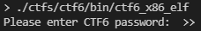

You can enter any string of text that you would like, followed by the `enter` key. If you get the password wrong, you will get a message like the following:

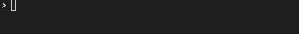

If you get the password correct, you will get a message like the following, but with legible text:

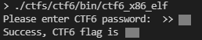

It is useful to note that you can also give the password to the binary as an argument for faster testing.

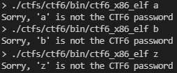

The goal of this exercise is to get the flag without knowing the password beforehand, and without having access to source. In this case you could just go directly to the source code, since it is provided. That would ruin the exercise though. The source is provided for those who are curious to try re-compilation of the source with various flags, compilers, and architectures and do comparisons of binaries and of Ghidra output.

Instead of going to the source, the challenge for the beginner binary hacker is to use the walkthrough below to guide you through the process of capturing the flag using some of the most basic binary reverse engineering tools.

---

## Obfuscation ##

Obfuscation for this exercise was done by running text through a [checksum](https://en.wikipedia.org/wiki/Checksum)-like algorithm.

---

## Walkthrough ##

### Open `ctf6_x86_elf` using Ghidra ###

1. Import the binary
2. Analyze the binary

### Find the password checking function ###

1. Open the "Defined Strings" window
2. Locate a recognizable string in the strings window
3. Select a string in the strings window

    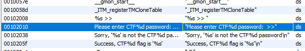

    Follow the external reference (XREF) to the function that makes use of your selected string.

    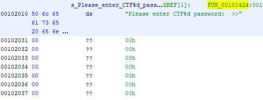

4. Click decompilation window to bring it into the foreground.

    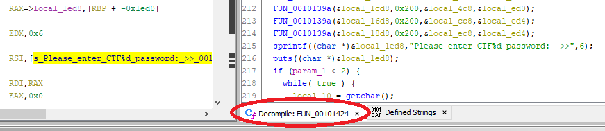

### Investigate password checking function `FUN_00101424` ###

Note the lack of legible string or text data.

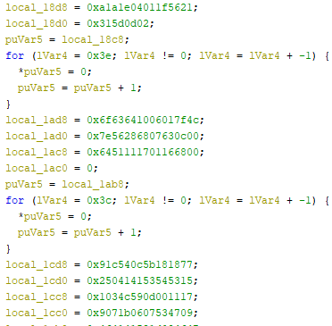

Right before the password prompt, we see that this data is put through a function whose signature looks similar to those seen in previous exercises.

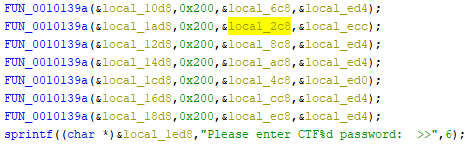

We can see that `local_2c8` is our password, based on the logic.

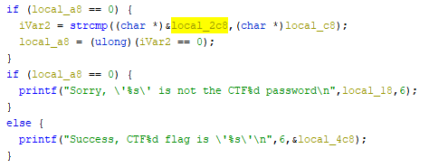

### Investigate obfuscation function `FUN_0010139a` ###

- Initially the function looks like the ones we've seen before.

    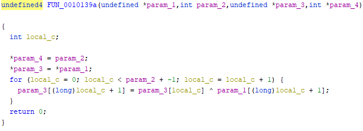

- Edit the types to makes things a bit clearer. The loop is looping through incrementing by one, so the types are either `char*` or in Ghidra `byte*`.

    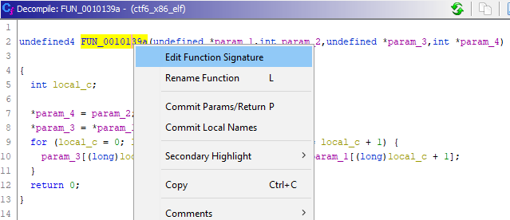
    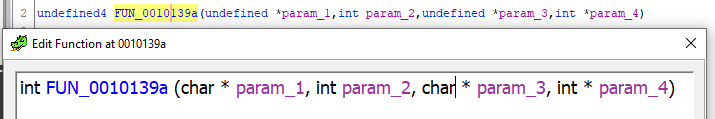

- After making these edits, we can now do the math or write a function to reverse engineer the flag and password. But as a hacker, it is always best to find a way to cheat. Lets go back and see if we can tell why the main function looked so different.

### Keep Investigating the password checking function `FUN_00101424` ###

- Investigate the password check

    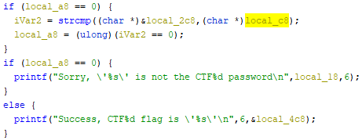

- Where did `local_c8` get assigned, was it `FUN_0010139a` as expected?

    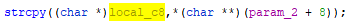

- [strcpy](https://www.cplusplus.com/reference/cstring/strcpy/) should cause some alarm bells to go off if you are familiar with common C programming mistakes.

    If you are less familiar, here is an excerpt from the help text on cplusplus.com:

    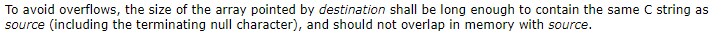

    This basically just says that if I have ten bytes of data, and I try to put them into a variable that can only hold 5, then 5 bytes of data will overflow and overwrite whatever data was supposed to come next. Exploiting this vulnerability is called a [buffer overflow](https://en.wikipedia.org/wiki/Buffer_overflow). Lets figure out the size of the variable and try to see if we can buffer overflow (we could also just try passing lots of data to see what happens).

### Look for exploitable buffer overflow ###

We need to find the variable being copied into, and find out if the variable(s) that would be overflowed into could be useful.

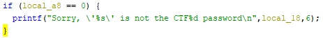

The check for success checks if `local_a8` is zero.

`local_a8` is assigned in two possible places.

- strcmp #1

    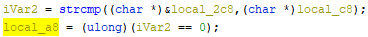

- strcmp #2

    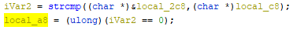

Both assignments are base on the strcmp of `local_2c8` and `local_c8`. We already determined that `local_2c8` must be the password, so lets find where `local_c8` is assigned.

- `local_c8` assignment #1

    The variable is assigned from an argument to the function (most likely the argument to the binary), then length of the string is calculated, and then if the last character is not zero then a zero is appended.
    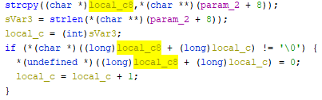

- `local_c8` assignment #2

    This assignment is less obvious. We saw that the other strcmp call was using the value of `local_c8`, but it does not appear to be getting any value assigned.

    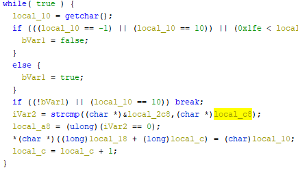

    Since we can see that the variable is being used, we will make the assumption that it was assigned a value. If we trace the variable upwards, we will find that the pointer was copied into another variable so that there are two pointer variables pointing at the same memory.

    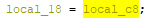

    Looking back at our loop, we will find that `local_18`, which is just a clone of `local_c8` is being assigned each character that the user types using the [getchar](https://www.cplusplus.com/reference/cstdio/getchar/) function.

    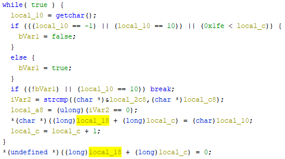

    We now know that `local_c8` is assigned user input with absolutely no limitations on the number of characters. This is because in one case user input is read using a `while true` loop, and the other case uses [strcpy](https://www.cplusplus.com/reference/cstring/strcpy/) rather than the safer [strncpy](https://www.cplusplus.com/reference/cstring/strncpy/).

- Investigate the stack

    This is one area that IDA Pro did better than Ghidra does at the time of this writing. We need to determine if we can affect the logic of the function by overflowing the variable `local_c8`. Ghidra shows us the variables in the order they are in memory in the decompilation view which is very handy, but a table view would be nicer.

    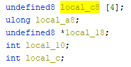

    We can see that `local_a8`, `local_18`, `local_10`, and `local_c` all come after `local_c8` which implies that we could overwrite them by writing too much data into the buffer. If we recall the password check portion of the code, `local_a8` was used to determine which message to print out to the user.

    

    It appears that if we write enough non-zero bytes into the buffer that we could potentially overwrite the variable that determines which message to print back to the user.

    If we go to the disassembly view and scroll to the top of the function we find a useful view of the stack that can help us determine the size of stack variables.

    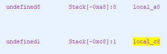

    Based on this information from Ghidra, we can guess that the `local_c8` buffer is 0x20 (32) characters long. Anything more than that should overflow into `local_a8`.

Try to buffer overflow the password prompt.
